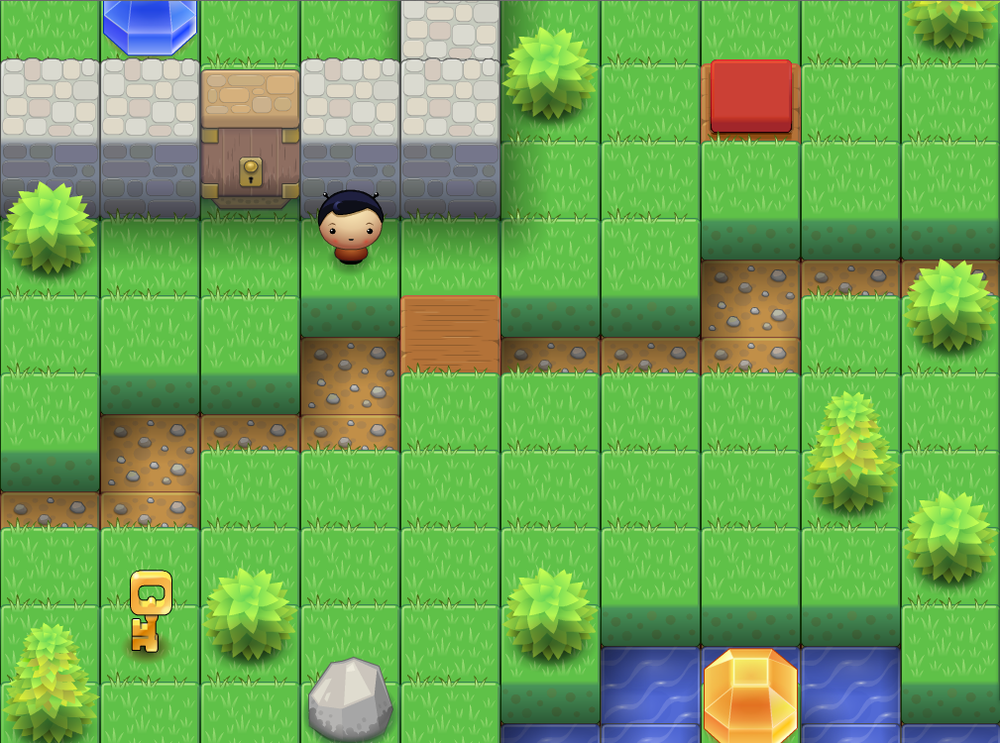
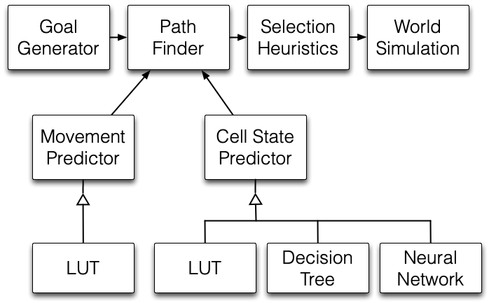

# CS545 (Machine Learning) Final Project

This repo contains the code, results, and final report from a term project I did for a grad-level machine learning course (CS545) at Colorado State University (Fort Collins, CO).

## Machine Learning in a Dynamic Game Environment

This paper investigates the use of machine learning to improve non-player character behavior in dynamic game environments where terrain and game logic can change during play. A simple 10×10 grid-based game was developed to test five AI agents ranging from basic pathfinding to models augmented with movement prediction and cell-state prediction using lookup tables, decision trees, and neural networks. These agents were evaluated across eight custom levels featuring hidden obstacles and changing world states, and their performance was compared with that of three human players. The results show that adding learned predictions about environmental change substantially improves performance over static pathfinding alone, with the best machine-learning agents performing within the range of human players. These findings suggest that machine learning can help game agents adapt more effectively to dynamic worlds and behave in ways that appear more intelligent to players.

[Read the final report here.](report/CS545-Strout2012.pdf)

_Sample map from the game world.  The player avatar is just northwest of the wooden bridge.  The red button has already been pressed, causing the bridge to appear, providing a path to the green gem._

_Agent architecture._

